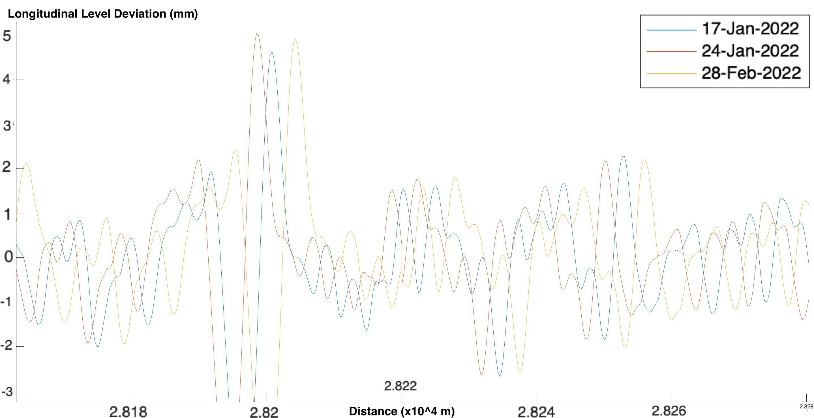
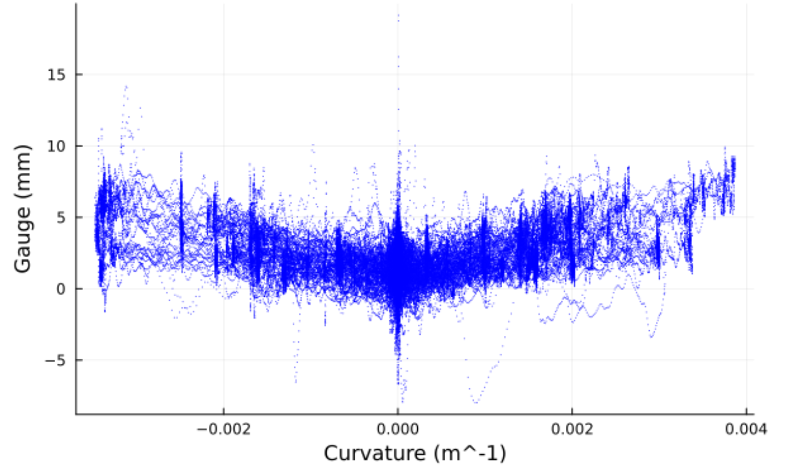
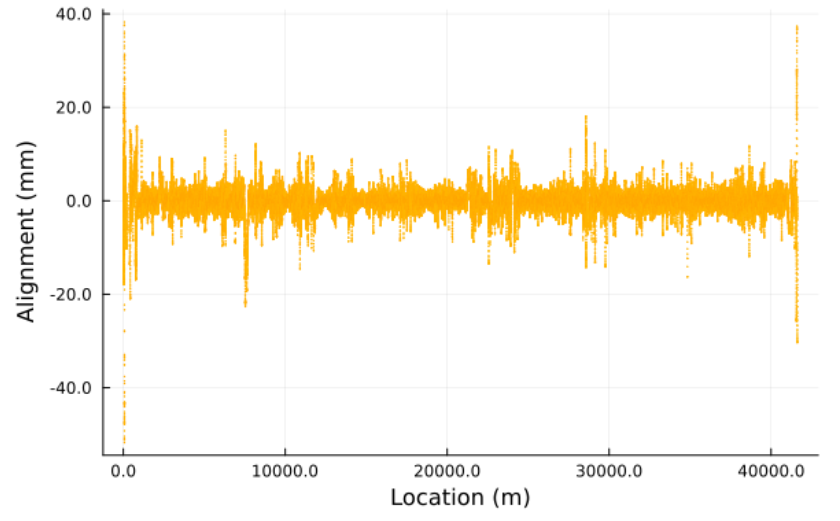

# Exploratory Analysis
## General Dataset Description: 
This document will concentrate primarily on line 27, which travels between Ostra and Karsta. This is because the analysis of the railroad lines would be the same for all of them. The reason that line 27 was chosen is because it has the most data out of the other three lines in the list. The primary dataset for line 27 is comprised of sixty.csv files, each of which includes a collection of measurements that were gathered from a particular segment of the Roslagsbanan network in Stockholm. These measurements were collected at various points along the network. Track measuring equipment, which was mounted on the trains and operated while the trial run was being conducted, was used to take the measurements.The dates on them range from October 2021 to May 2022.

 

Every file represents a unique measurement run that was performed on a particular section of the track. In addition, the number of measurement runs that are performed on each sector of the track is differentiated from one another according to the relative importance of the sectors. For instance, the section of the track that extends between 27 and 38 kilometers has been measured in more than twenty different time points, whereas other sections do not have such a high number of runs. The map of the lines can be seen below in the @fig:geo-map-1. Line 27 is the line that will be considered in this document.

{#fig:geo-map-1 width="4in"}

It is important to keep in mind that the data may require cleaning in some instances. For instance, it has a lot of NA cells that say "N/A". It also has some questionable data points, particularly during the time when the train was slowing down to a stop, which caused some outliers. `[plot showing what happens with 0 speed?]. I like this idea too`

The date and time of the measurements are not hardcoded in the .csv document but only mentioned in the file name, as such the code for analyzing will have to take into account the name of the file when making comparisons. As shown in `Figure 2`, the measurement runs are not completely synchronized, they must match or correlate in some way to clearly interpret the results. 

{#fig:desync-1 width="5in"}

## Statistics Analysis:
In this section, we will discuss the science of data mining, which is the process of analyzing, and presenting large amounts of data in order to find hidden patterns and trends.
 `Table 1` shows the main properties of the measurement files. 

| Properties | Value |
|----------|----------|
| Earliest measurement | 21st October 2021 |
| Latest measurement | 10th May 2022 |
| Line Length | 41.700 km (25.91 miles) |
| Data points per file | 20,000 to over 100,000 |

Table 1: Summary Table. {#tbl:sum-table-1}

`Table 2` shows the statistical analysis of the measured parameters in order to show the range, mean, median and standard deviation of the values we will use. 

| Variable | Mean | Min | Median | Max | St Deviation |
|----------|----------|----------|----------|----------|----------|
| Curvature | 4.995e-5 | -0.004 | 2.310e-6 |0.004 | 0.001|
| Cant|1.629| -96.630 | -0.490 |	91.393 |32.158|
| Twist 3m |  -0.003 | -7.542 | -0.001 |	6.703 |1.172|
| Track Gauge |  2.010 | -7.989 | 1.779 |19.149 |1.721|
| Alignment Versine Right|  -0.043 | -51.756 | -0.005 |38.235 |2.575|
| Level Versine Right |  -0.003 | -11.951 | 0.039|11.808 |1.348|

Table 2: Statistical analysis of the parameters for the Ostra-Karsta line, measurement date 02/08/2022. {#tbl:sum-table-1}

## Data Correlation:
An important fact of the parameters considered is that some of them are directly related in a mathematical sense. For example, the parameter cant is proportional to the curvature, which means that when the track is being built, the superelevation is calculated based on the curvature at a given location, as follows:

$$E_e=\frac{G*V^2}{gR}$$

Where E_e is balancing superelevation or cant, G (track gauge), g (gravity), and V (line speed) are constants and R is curve radius, the inverse of curvature.[1] 

Similarly, twist describes the rate of change of cant over a certain distance, and thus a close correlation between them is expected. These parameters are summarised in Figure @fig:cant_diag_1 below, courtesy of Kawasaki Track Technology:

{#fig:cant_diag_1 width="5in"}

Figure @fig:curv_cant_twist shows these relations among the parameters for the Karsta line. From the curvature and cant plots, it can be observed that there is a strong relationship between them, as both exhibit similar patterns. However, in the case of twist correlation with the other variables, similar patterns may not be very clear. More analysis might be done on this line. 

These relationships between the Karsta line's parameters are illustrated in the figure with the identifier @fig:curv_cant_twist. As a result of the similarities in the patterns that both the curvature plot and the cant plot display, it is possible to deduce that there is a close connection between the two variables. On the other hand, when considering the twist correlation with the other variables, it's possible that similar patterns won't be very obvious. In spite of the fact that it is known to be mathematically correlated, additional investigation may be required in order to discern the pattern. On this particular line, additional research might be conducted.

{#fig:curv_cant_twist}

As for Gauge and Curvature, while there is no strict relationship between them when plotting the two parameters, it can be observed that at higher curvatures, the distance between tracks also increases. Figure @fig:gauge-curve1 and Figure @fig:gauge-curve2 show this fact. 

{#fig:gauge-curve1 width="5in"}

{#fig:gauge-curve2 width="5in"}

Finally, `Figure XX` includes the variation of the Alignment along the whole line.'

{#fig:gauge-curve2 width="5in"}

# Predictive modelling
Due to the somewhat limited amount of independent variables already present inside the measurement set, there may be challenges. Correlation plots can help us determine links between variables and what model to create.  
The first part of the predictive model will try and find locations where the track degradation seems to form a clear trend (typically a linear increase in a given direction) over time. Here, time is the independent variable. From an initial analysis of the dataset and knowledge of railway track engineering, it is likely this predictive model will yield some results.
The second part of the predictive model we would like to create would take into account external factors, in particular temperature/weather changes and soil properties if obtainable. This could give us locations prone to developing trends in the short to medium term, which could be investigated by a maintenance team.  However we have envisioned some possible issues, namely that obtaining and translating soil data into something usable by the model may be a challenge, and no link is guaranteed to appear (what if all soils are similar?). A possible approach could be to grade soils based on properties, for example a very stable soil could get a score of 1 and a worse soil from the point of view of building a railway line could get a score of 4 (or higher/lower), with appropriate intermediate values. To resolve this, we could look into D30/D10/D60 soil values. 
Finally another research path for a predictive model would be to investigate more in depth the link between measured variables which are not mathematically correlated, but seem to exhibit some kind of relationship, such as gauge and curvature earlier (although both are meant to be completely independant from a civil engineering point of view). The finality of this is being able to predict the state of certain properties of the track which are complex to measure, using knowledge of established properties which do not require special measuring gear. In this example, curvature of track is well known and extremely stable, but small gauge variations necessitate state-of-the-art apparatus to measure.   

