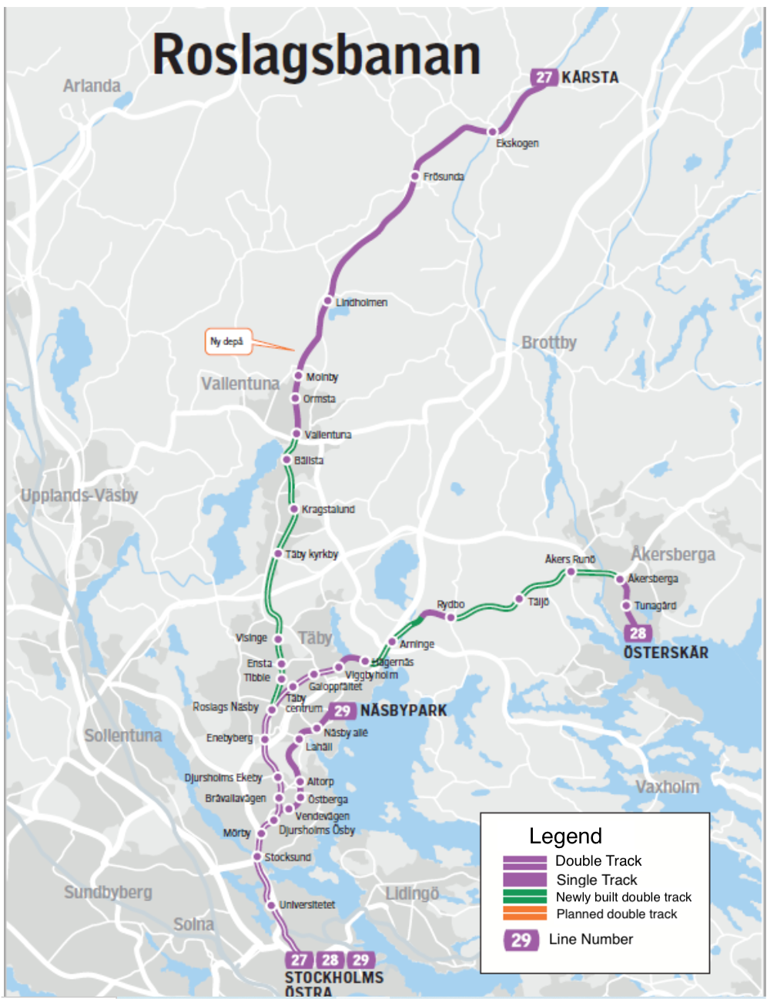

# Exploratory Analysis
## General Dataset Description: 
The main dataset is composed of 60 .csv files of measurements taken on part of the railway tracks of the Roslagsbanan network in Stockholm. They are dated from October 2021 to May 2022 and the measurements were made using track measuring equipment installed on the trains and working during the trial run.

Each file corresponds to a specific measurement run, on a given part of the track. Additionally, each section of the track has a different number of measurement runs, depending on how important the measurement crew considered the section. For example, the segment between approximately the 27 and 38 km points comprises more than 20 different runs (usually traveling north and then south on the same day) while other sections do not have such a number of measurements. Figure @fig:geo-map-1 below shows a map with the lines that will be studied in this document.

`{##[Stats on how many measurements per section? Plot with a heatmap of the line and number of measurements? It looks interesting to analyse`]##}`

{#fig:geo-map-1 width="5in"}

It should be noted that in some cases the data needs to be cleaned. For example, it contains many N/A cells, as well as some questionable data points, especially when the train was coming to a stop, which produced some outliers. `[plot showing what happens with 0 speed?]. I like this idea too`

The date and time of the measurements are not hardcoded in the .csv document but only mentioned in the file name, as such the code for analyzing will have to take into account the name of the file when making comparisons. As shown in Figure {@fig:desync-1}, the measurement runs are not completely synchronized, they must match or correlate in some way to clearly interpret the results. 

{#fig:desync-1 width="5in"}

## Statistical Analysis:
[Stats summary about size, distance covered, frequency of measurements, others?]

| Statistic | Value |
|----------|----------|
| Earliest measurement | 21st October 2021 |
| Latest measurement | 10th May 2022 |
| Line Length | 41.700 km (25.91 miles) |
| Data points per file | 20,000 to over 100,000 |
| File size |  |

Table 1: Summary Table. {#tbl:sum-table-1}

`Something is weird with the title of this table, it appears something else in the pdf version`
`We could include in this section the mean and standard deviation of the columns, for instance, gauge, alignment, height (that wee know they should be the same in the entire longitude)`

## Data Correlation:
An important fact of the parameters considered is that some of them are directly related in a mathematical sense. For example, the parameter cant is proportional to the curvature, which means that when the track is being built, the superelevation is calculated based on the curvature at a given location, as shown by Equation @eq:cant below:

$$\frac{G*V^2}{gR}$$ {#eq:cant}

Where E_e is balancing superelevation or cant, G (track gauge), g (gravity), and V (line speed) are constants and R is curve radius, the inverse of curvature.[1] 

Similarly, twist describes the rate of change of cant over a certain distance, and thus a close correlation between them is expected. These parameters are summarised in Figure @fig:cant_diag_1 below, courtesy of Kawasaki Track Technology:

{#fig:cant_diag_1 width="5in"}

Figure @fig:curv_cant_twist shows these relations among the parameters for the Karsta line. From the curvature and cant plots, it can be observed that there is a strong relationship between them, as both exhibit similar patterns. However, in the case of twist correlation with the other variables, similar patterns may not be very clear. More analysis might be done on this line. 

{#fig:curv_cant_twist width="5in"}

As for Gauge and Curvature, while there is no strict relationship between them when plotting the two parameters, it can be observed that at higher curvatures, the distance between tracks also increases. Figure @fig:gauge-curve1 and Figure @fig:gauge-curve2 show this fact. 

{#fig:gauge-curve1 width="5in"}

{#fig:gauge-curve2 width="5in"}

# Predictive modelling

Due to the somewhat limited amount of independent variables already present inside the measurement set, there may be challenges. Correlation plots can help us determine links between variables and what model to create.  
The first part of the predictive model will try and find locations where the track degradation seems to form a clear trend (typically a linear increase in a given direction) over time. Here, time is the independent variable. From an initial analysis of the dataset and knowledge of railway track engineering, it is likely this predictive model will yield some results.
The second part of the predictive model we would like to create would take into account external factors, in particular temperature/weather changes and soil properties if obtainable. This could give us locations prone to developing trends in the short to medium term, which could be investigated by a maintenance team.  However we have envisioned some possible issues, namely that obtaining and translating soil data into something usable by the model may be a challenge, and no link is guaranteed to appear (what if all soils are similar?). A possible approach could be to grade soils based on properties, for example a very stable soil could get a score of 1 and a worse soil from the point of view of building a railway line could get a score of 4 (or higher/lower), with appropriate intermediate values. To resolve this, we could look into D30/D10/D60 soil values. 
Finally another research path for a predictive model would be to investigate more in depth the link between measured variables which are not mathematically correlated, but seem to exhibit some kind of relationship, such as gauge and curvature earlier (although both are meant to be completely independant from a civil engineering point of view). The finality of this is being able to predict the state of certain properties of the track which are complex to measure, using knowledge of established properties which do not require special measuring gear. In this example, curvature of track is well known and extremely stable, but small gauge variations necessitate state-of-the-art apparatus to measure.   
