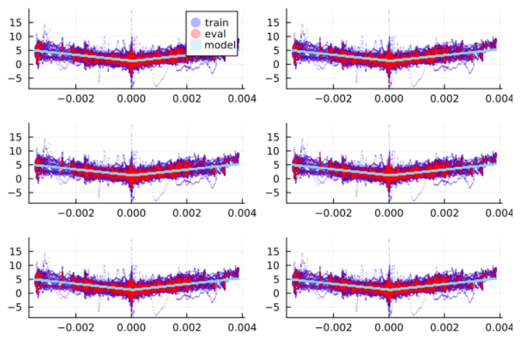
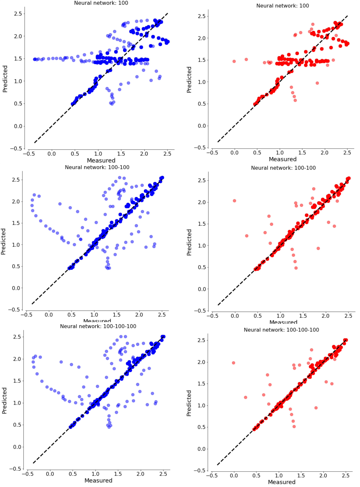
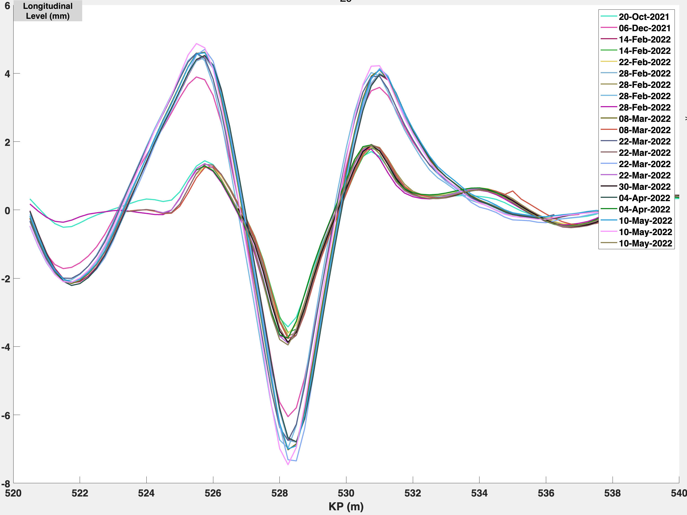
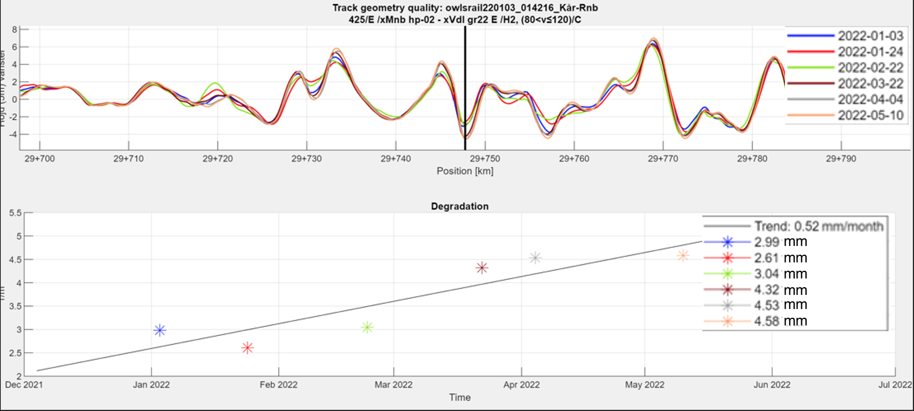

# Predictive Modeling
## Predictive Model Decisions
Following the reflexion of the Exploratory Analysis, specific decisions were taken for the modeling. It was found that obtaining reliable soil data usable for such a project was not practical, for that reason the link with soil mechanics was not explored at this stage. Moreover, it was decided that building a model to verify the link between mathematically related variables (e.g., curvature and cant) is not a relevant engineering problem to solve, and thus was not looked at. Finally the modeling performed at this stage focused on finding the most reliable link between curvature and gauge deformation in one part, and studying the degradation of longitudinal level over time in another part. 

## Gauge vs Curvature Predictive Modeling 
As shown in Figure @fig:gauge-curve2, the Gauge and Curvature variables seem to be related. Since gauge measurements are not as easy to obtain as curvature measurements, finding the relationship between gauge and curvature could give technicians a way to measure gauge indirectly.

To start analyzing a model that fits the data, first, it can be observed that the data exhibit some symmetry around the curvature = 0 axis. Figure @fig:gaugecurv_abs shows the absolute values of curvature, and reflects how the positive and negative values are close in shape.

{#fig:gaugecurv_abs width="5in"}

Then, the method used to predict a model for this relationship was linear regression. 
Since it was unclear which model structure would best fit the data, two structures were assumed and compared to determine the best one. 
The two model structures used were,

$\hat{y}_{linear}= β_1*X+ β_2$

$\hat{y}_{exp}= β_1*X_{exp}+ β_2$ where $X_{exp}= e^x$

$\hat{y}_{linear}$ and $\hat{y}_{exp}$ is the model prediction, the gauge prediction.
$X$ is the independent variable, the curvature. $β_1$ and $β_2$ are the paramenters that are learnt using gradient descent.

In order to allow the gradient descent to work properly, the curvature data were normalized by subtracting the mean and dividing by the standard deviation.

The measure of error between the model predictions and the gauge raw data used is the mean squared error (MSE):

$MSE = \sum_{i=0}^{n} \frac{(\hat{y}_{i}-y_i)^{2}}{n}$

In order to avoid overfitting, the data is tested by the cross-validation method. Curvature values are divided into 6 groups, one part is used to predict the model, and the other part is used to evaluate it. 

Finally, the root mean square error (RMSE) was calculated to check which model gives more accurate results, 

$RMSE = \sqrt{\sum_{i=0}^{n} \frac{(\hat{y}_{i}-y_i)^{2}}{n}}$

Figure @fig:cross_linear and Figure @fig:cross_exp show the graphs of the 6 data split groups for each model, detailing data training, data evaluation, and model prediction. The $β_1$ and $β_2$ values of the two models are shown in Table 3.

{#fig:cross_linear width="5in"}

{#fig:cross_exp width="5in"}

**Table 3**: $β_1$ and $β_2$ values of the two models after cross-validation application .

| $β_1^{linear}$ | $β_2^{linear}$ | $β_1^{exp}$ | $β_2^{exp}$ |
|----------|----------|----------|----------|
| 1.298792|1.209706| 0.271697 | 1.249403 |
| 1.311299	|1.197514|	0.273704|	1.245887 |	
| 1.307062|	1.205466|	0.271832	|1.250013 |
| 1.309875	|1.200968|	0.272914|	1.250626 |
| 1.306893	|1.201039|	0.272542	|1.248218|
|1.317865|1.192273	|0.274033|	1.240401|

Considering the above methodology and the average of $β_1$ and $β_2$, the models found for the gauge-curvature relation were:

**Linear Model:**

$Gauge_{linear} = \left\lbrace\begin{array}{c} 1.309*Curvature + 1.201~~~~~~~~when~ Curvature \geq 0\\ -1.309*Curvature + 1.201~~~~~~~~when~ Curvature < 0 \end{array}\right.$

**Linear Exponential:**

$Gauge_{exp} = \left\lbrace\begin{array}{c} 0.273*e^{Curvature} + 1.247~~~~~~~~when~ Curvature \geq 0\\ 0.273*e^{-Curvature} + 1.247~~~~~~~~when~ Curvature < 0 \end{array}\right.$

The RMSE found for each model were:

$RMSE_{linear} = 1.379$

$RMSE_{exp} = 1.434$

The RMSEs are very close, but linear model is bit more accurate than the exponential one. 

Figure @fig:gaugecurv_abs_model shows the data for negative and positive curvature values and the linear predicting model. Although the model is reliable and fits the data well as a whole, it seems to be rather difficult to capture the upper values. 

{#fig:gaugecurv_abs_model width="5in"}

## Different Models for Gauge vs Curvature Predictive Modeling 

Underfitting and overfitting can lead to models that do not match the available data; therefore, we must determine ways to recognize each issue and create models that do match the data. These notions can help you avoid big errors and build models that match the data pretty well; yet, there are an astonishing amount of models that suit this criteria. This implies that the following stage, after developing a model that fits adequately, is to determine which of the various models fits the data the best.

Fundamentally, you cannot rely on a model that fits the training data well simply because you created it. This is because you compelled the model to be a good match for the training data. If, after building a model, statistical analyses indicate that it matches the data well, it is feasible to compel a model to match the data well using mathematical procedures. This does not imply that the model captures actual patterns or can forecast future events.
Validating models is the solution to this issue. Validation is the process of utilizing the model to forecast the output in additional contexts for which you have data, and then computing the same statistical measures of fit for the outcomes. This implies that your dataset must be split into two separate data files. The first is a training data set, which is utilized to create models. The second data set is a validation data set, which is used to evaluate the correctness of your model using data that was not used to train it.

To minimize overfitting while learning a dependency from data, it is essential to divide the data into a training set and a testing set as mentioned abive. We first train our model on the training set, and then evaluate the accuracy of the final model using the testing set. The optimal results are produced by using 15% of the data for testing and the remaining 85% of the data for training, according to empirical research. Figure@fig:gaugecurv_abs_various_models shows the values obtained for various models.

Figure @fig:gaugecurv_abs_predictive_model_comparison_table shows the various models we have tested apart from the linear regression done previously and here with different approach of training. We try analysing the data with other models which include include Linear regression, Support vector regression, Decision tree, k-nearest neighbors, eXtreme Gradient Boosting (XGB) and neural network with various levels of hidden layers Figure @fig:gaugecurv_abs_predictive_model_comparison_table also indicates how different models perform better than the linear regression and Firgures @fig:gaugecurv_abs_various_models, @fig:gaugecurv_abs_various_models2 and @fig:gaugecurv_abs_various_models3 show how the predicted and measured values are distributed over the line of equality which indicates how well the model is doing prediction.

{#fig:gaugecurv_abs_various_models width="5in"}

{#fig:gaugecurv_abs_various_models2 width="5in"}

{#fig:gaugecurv_abs_various_models3 width="5in"}

{#fig:gaugecurv_abs_predictive_model_comparison_table add width="5in"}

## Time vs Longitudinal Level Predictive Modeling
Because of greater familiarity with the software, MATLAB was used for this part of the predictive modelling. The main tasks to be addressed were:

1)	Find a way to import and manage the large quantity of .csv files;

2)	Clean the files of NA data as well as unrelated measurements, and associate them with a measurement date;

3)	Match or synchronize the different measurement runs as explained in the Exploratory Analysis;

4)	Find a reasonable method for detecting locations showing steady and significant degradation of longitudinal level;

5)	Aggregate those so that the person performing the analysis can judge the relevance of these locations.

To address the first point, a starting idea was to use a loop of the “readtable” feature, importing one file at a time, and performing the desired operations on it. However, as a result of further research and speed concerns, the software uses the recent “datastore” feature of MATLAB, which can efficiently import, clean, and sort a very large amount of data, even beyond what can fit in memory. While Roslagsbanan data were still reasonable in size (60 files with a total size of approximately 1GB), this significantly increased the speed of the model compared to a more traditional “readtable” based loop and makes the method applicable to any size data set in the future. With this function, the desired columns (i.e., variables) can be selected and imported from the get-go, as opposed to bloating the memory with all the data and dropping large parts of it after the fact. 

This brings on the second point, where the dropna() function was used to delete rows with N/A values easily. Then, a short custom function using “fileparts()” is capable of extracting the date of measurements from the file name and convert it to a date value usable by matlab – which will have its importance. 
Then, for each data file, the software finds peaks in the rail longitudinal level so long as they exceed alert level A (4mm), and they are spaced by a set distance, by means of the findpeaks() function. The distance was tweaked during the modelling to reach a satisfactory result, in the manner of a hyperparameter. A smaller distance shows more points but potentially more unwanted peaks while a larger distance is more restrictive but also could lead to missed locations.  This process aims to reduce the number of analyzed points to only keep significant spikes in the positive or negative. 

All these peaks and their respective position and time of measurement are assembled in a table and compared through a correlation analysis. The correlation function of MATLAB is used to compare the maximum value of peaks at the same location over a certain timespan, to show any possible trends. Only the locations where a certain threshold of correlation (typically 0.75, but this parameter was also adjusted during the analysis) is exceeded across at least four points of data are kept by the model for user review. Finally, this allows the model to output a shortlist of locations which display a spike or a sag with a degradation trend. The model also outputs a R^2 value to reflect the goodness of linear fit, and a crude estimate of when Alert C (deviation of 16mm or more in the positive of negative) would be exceeded at this rate. While not absolute or perfect, these metrics these give a general idea of the rate of degradation and the criticality of the problem, and on a more macro level the relevance of the model output.
After various adjustments to the parameters with a correlation threshold of 0.8 and peak spacing of 4m, the model output 100 points (including positive and negative trends). As could be expected from a physical perspective, twice as many negative (i.e., sinking) trends than positive trends appeared, possibly due to settlement and rail traffic. This gives some credibility to the algorithm.

In general, the model fulfilled its role and did find locations of clear, steady degradation over time which would have taken a human weeks of going over graphs and data manually – even for a domain professional. However not all results were satisfactory. In particular the model struggled with two aspects:
-	Measurement on double track sections with each track having a different level of degradation, as shown on Figure @fig:twotracks, tricked the model into seeing a trend which does not exist (as measurements were taken in both directions).

{#fig:twotracks width="5in"}

-	Locations which do show a trend but of extremely minute, though steady, variation. For example on Figure @fig:tiny_trend, following this trend the level of the track would reach a concerning value after a decade or more. This is not so relevant for the engineer. This was the most common issue.  

{#fig:tiny_trend width="5in"}

In terms of accuracy, out of the hundred points picked up by the model, only eight of them could be considered to exhibit a trend necessitating urgent maintenance. This may seem catastrophic at first but it must be kept in mind that this is across fourty kilometers of line on sixty files, so narrowing down the result to just a hundred locations is already powerful. The locations highlighted are summed up in Table 4.

**Table 4**: Key locations as found by the model and sorted.

|     Figure    |     Position (km)    |     Trend (mm/month)    |     Measurement Period        |
|---------------|-----------------|-------------------------|-------------------|
| @fig:track27  | 27+636          | +0.5                    | 03/01/22-10/05/22 |
| @fig:track29  | 29+750          | -0.5                    | 03/01/22-10/05/22 |
| @fig:track32  | 32+030          | -1.7                    | 03/01/22-10/05/22 |
| @fig:track33  | 33+290          | -0.7                    | 03/01/22-10/05/22 |
| @fig:track34  | 34+840          | -0.5                    | 03/01/22-10/05/22 |
| @fig:track38  | 38+207          | -0.6                    | 03/01/22-10/05/22 |
| @fig:track7   | 7+968           | +0.8                    | 14/02/22-10/05/22 |
| @fig:track8   | 8+530           | -1.0                    | 14/02/22-10/05/22 |

The results are displayed in more detail in Figure @fig:track27 to Figure @fig:track8. For each figure, the upper graph shows the amplitude of the parameter along a short section of track, spanning approximately one hundred meters with the key location in the centre. The lower degradation graph shows the evolution of the parameter value at the key location, to judge its change over time. For clarity, the graphs are plotted only for the left side rail in the cases where the trend in level was identical for both the left and right side rails.

{#fig:track27 width="5in"}

{#fig:track29 width="5in"}

{#fig:track32 width="5in"}

{#fig:track33 width="5in"}

{#fig:track34 width="5in"}

{#fig:track38 width="5in"}

{#fig:track7 width="5in"}

{#fig:track8 width="5in"}

All in all, this model represents a serviceable tool for use in the track measurement industry. Its accuracy leaves somewhat to be desired, as a relatively portion of its output could be considered “incorrect” or “irrelevant” by an engineer looking to find critical degradation trends. The adjustment of inputs parameters may also affect the results significantly, but any kind of analysis is likely to require well-thought out input and critical thinking from the engineer. The problem at hand does not have an absolute truth or precise correct answer, and different engineers may judge the quality of this output differently themselves. Globally the model was successful in identifying key locations thousands of times faster than a human expert could, and the saying still seems to hold true: the quality of a machine depends largely on its user.   