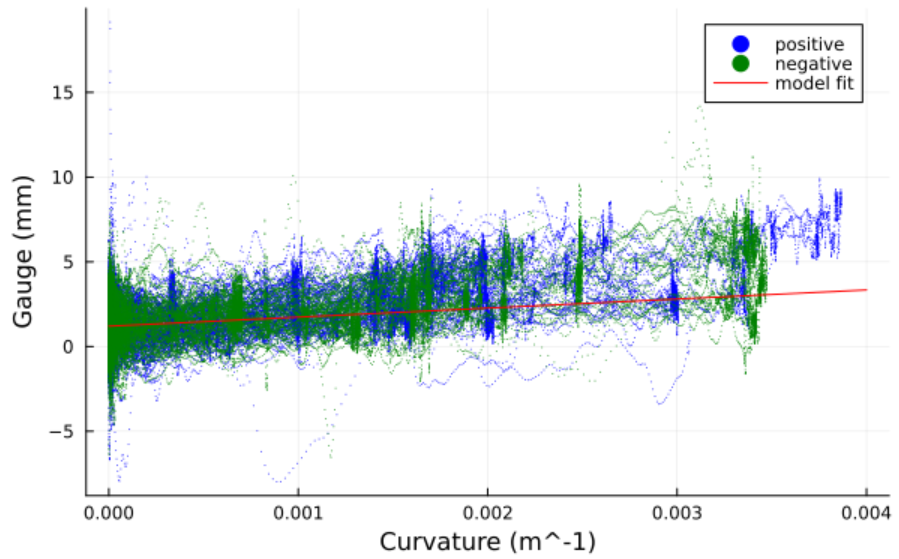

# Preliminary Predictive Modeling
## Gauge vs Curvature Predictive Modeling 
As shown in Figure @fig:gauge-curve2, the Gauge and Curvature variables seem to be related. Since gauge measurements are not as easy to obtain as curvature measurements, finding the relationship between gauge and curvature could give technicians a way to measure gauge indirectly.

To start analyzing a model that fits the data, first, it can be observed that the data exhibit some symmetry around the curvature = 0 axis. Figure @fig:gaugecurv_abs shows the absolute values of curvature, and reflects how the positive and negative values are close in shape.

{#fig:gaugecurv_abs width="5in"}

Then, the method used to predict a model for this relationship was linear regression. 
Since it was unclear which model structure would best fit the data, two structures were assumed and compared to determine the best one. 
The two model structures used were,

$ \hat{y}_{linear}= β_1*X+ β_2 $

$ \hat{y}_{exp}= β_1*X_{exp}+ β_2 $ where $ X_{exp}= e^x $

$\hat{y}_{linear}$ and $\hat{y}_{exp}$ is the model prediction, the gauge prediction.
$X$ is the independent variable, the curvature. $β_1$ and $β_2$ are the paramenters that are learnt using gradient descent.

In order to allow the gradient descent to work properly, the curvature data were normalized by subtracting the mean and dividing by the standard deviation.

The measure of error between the model predictions and the gauge raw data used is the mean squared error (MSE):

$MSE = \sum_{i=0}^{n} \frac{(\hat{y}_{i}-y_i)^{2}}{n}$

In order to avoid overfitting, the data is tested by the cross-validation method. Curvature values are divided into 6 groups, one part is used to predict the model, and the other part is used to evaluate it. 

Finally, it calculated the root mean square error (RMSE) to compare which model gives more accurate results, 

$RMSE = \sqrt{\sum_{i=0}^{n} \frac{(\hat{y}_{i}-y_i)^{2}}{n}}$

Figure @fig:cross_linear and Figure @fig:cross_exp show the graphs of the 6 data split groups for each model, detailing data training, data evaluation, and model prediction. The $β_1$ and $β_2$ values of the two models are shown in Table XX.

{#fig:cross_linear width="5in"}

{#fig:cross_exp width="5in"}

**Table 3**: $β_1$ and $β_2$ values of the two models after cross-validation application .

| $β_1^{linear}$ | $β_2^{linear}$ | $β_1^{exp}$ | $β_2^{exp}$ |
|----------|----------|----------|----------|
| 1.298792|1.209706| 0.271697 | 1.249403 |
| 1.311299	|1.197514|	0.273704|	1.245887 |	
| 1.307062|	1.205466|	0.271832	|1.250013 |
| 1.309875	|1.200968|	0.272914|	1.250626 |
| 1.306893	|1.201039|	0.272542	|1.248218|
|1.317865|1.192273	|0.274033|	1.240401|

Considering the above methodology and the average of $β_1$ and $β_2$, the models found for the gauge-curvature relation were:

**Linear Model:**

$ Gauge_{linear} = \left\lbrace\begin{array}{c} 1.309*Curvature + 1.201~~~~~~~~when~ Curvature \geq 0\\ -1.309*Curvature + 1.201~~~~~~~~when~ Curvature < 0 \end{array}\right.$

**Linear Exponential:**

$ Gauge_{exp} = \left\lbrace\begin{array}{c} 0.273*e^{Curvature} + 1.247~~~~~~~~when~ Curvature \geq 0\\ 0.273*e^{-Curvature} + 1.24~~~~~~~~when~ Curvature < 0 \end{array}\right.$

The RMSE found for each model were:

$RMSE_{linear} = 1.379$

$RMSE_{exp} = 1.434$

The RMSEs are very close, but linear model is bit more accurate than the exponential one. 

Figure @fig:gaugecurv_abs_model shows the data for negative and positive curvature values and the linear predicting model. 

{#fig:gaugecurv_abs_model width="5in"}