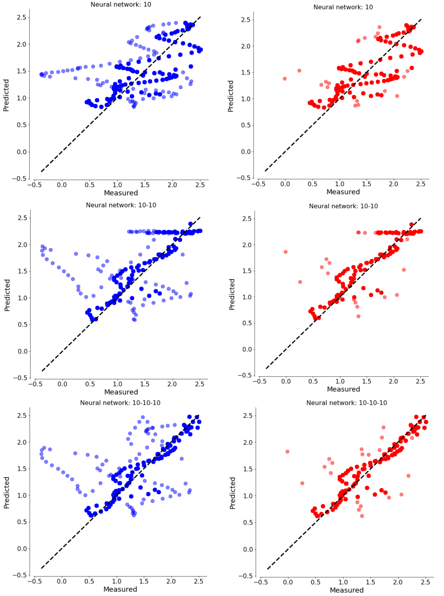
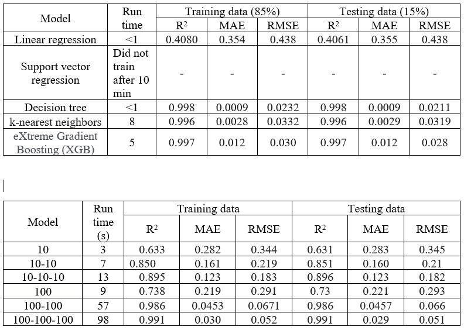
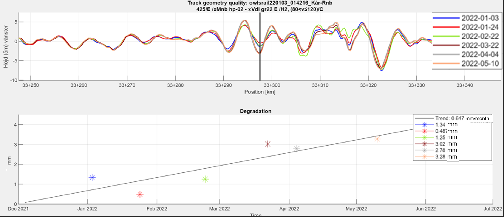
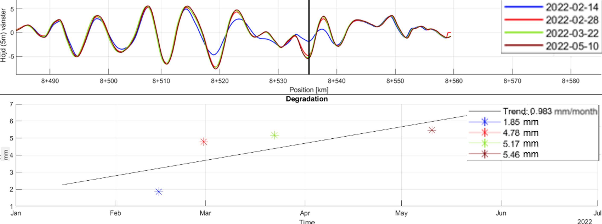

---
title: Safety Assessment of Roslagsbanan Rail System, 2021-2022
keywords:
- Railroad Systems
- Transportation Safety
- Track Degradation
lang: en-US
date-meta: '2022-11-21'
author-meta:
- Cecilia Karina Volpe Baridon
- Elie Roudiere
- Berkan Usta
header-includes: |-
  <!--
  Manubot generated metadata rendered from header-includes-template.html.
  Suggest improvements at https://github.com/manubot/manubot/blob/main/manubot/process/header-includes-template.html
  -->
  <meta name="dc.format" content="text/html" />
  <meta name="dc.title" content="Safety Assessment of Roslagsbanan Rail System, 2021-2022" />
  <meta name="citation_title" content="Safety Assessment of Roslagsbanan Rail System, 2021-2022" />
  <meta property="og:title" content="Safety Assessment of Roslagsbanan Rail System, 2021-2022" />
  <meta property="twitter:title" content="Safety Assessment of Roslagsbanan Rail System, 2021-2022" />
  <meta name="dc.date" content="2022-11-21" />
  <meta name="citation_publication_date" content="2022-11-21" />
  <meta name="dc.language" content="en-US" />
  <meta name="citation_language" content="en-US" />
  <meta name="dc.relation.ispartof" content="Manubot" />
  <meta name="dc.publisher" content="Manubot" />
  <meta name="citation_journal_title" content="Manubot" />
  <meta name="citation_technical_report_institution" content="Manubot" />
  <meta name="citation_author" content="Cecilia Karina Volpe Baridon" />
  <meta name="citation_author" content="Elie Roudiere" />
  <meta name="citation_author_institution" content="Railway Group, KTH Royal Institute of Technology - Stockholm, Sweden" />
  <meta name="citation_author" content="Berkan Usta" />
  <link rel="canonical" href="https://uiceds.github.io/cee-492-term-project-fall-2022-time/" />
  <meta property="og:url" content="https://uiceds.github.io/cee-492-term-project-fall-2022-time/" />
  <meta property="twitter:url" content="https://uiceds.github.io/cee-492-term-project-fall-2022-time/" />
  <meta name="citation_fulltext_html_url" content="https://uiceds.github.io/cee-492-term-project-fall-2022-time/" />
  <meta name="citation_pdf_url" content="https://uiceds.github.io/cee-492-term-project-fall-2022-time/manuscript.pdf" />
  <link rel="alternate" type="application/pdf" href="https://uiceds.github.io/cee-492-term-project-fall-2022-time/manuscript.pdf" />
  <link rel="alternate" type="text/html" href="https://uiceds.github.io/cee-492-term-project-fall-2022-time/v/468389bdfe35c07ec5ea600ff3f6b2af938e2b46/" />
  <meta name="manubot_html_url_versioned" content="https://uiceds.github.io/cee-492-term-project-fall-2022-time/v/468389bdfe35c07ec5ea600ff3f6b2af938e2b46/" />
  <meta name="manubot_pdf_url_versioned" content="https://uiceds.github.io/cee-492-term-project-fall-2022-time/v/468389bdfe35c07ec5ea600ff3f6b2af938e2b46/manuscript.pdf" />
  <meta property="og:type" content="article" />
  <meta property="twitter:card" content="summary_large_image" />
  <link rel="icon" type="image/png" sizes="192x192" href="https://manubot.org/favicon-192x192.png" />
  <link rel="mask-icon" href="https://manubot.org/safari-pinned-tab.svg" color="#ad1457" />
  <meta name="theme-color" content="#ad1457" />
  <!-- end Manubot generated metadata -->
bibliography:
- content/manual-references.json
manubot-output-bibliography: output/references.json
manubot-output-citekeys: output/citations.tsv
manubot-requests-cache-path: ci/cache/requests-cache
manubot-clear-requests-cache: false
...

<small><em>
This manuscript
([permalink](https://uiceds.github.io/cee-492-term-project-fall-2022-time/v/468389bdfe35c07ec5ea600ff3f6b2af938e2b46/))
was automatically generated
from [uiceds/cee-492-term-project-fall-2022-time@468389b](https://github.com/uiceds/cee-492-term-project-fall-2022-time/tree/468389bdfe35c07ec5ea600ff3f6b2af938e2b46)
on November 21, 2022.
</em></small>

## Authors

+ **Cecilia Karina Volpe Baridon** 
    · {.inline_icon}
    [cvolpebaridon](https://github.com/cvolpebaridon) 
  <small>
  </small>

+ **Elie Roudiere** 
    · {.inline_icon}
    [elieroudiere](https://github.com/elieroudiere) 
  <small>
     Railway Group, KTH Royal Institute of Technology - Stockholm, Sweden
  </small>

+ **Berkan Usta** 
    · {.inline_icon}
    [berkanusta](https://github.com/berkanusta) 
  <small>
  </small>

# Dataset Decription
The Roslagsbanan is a railway system operating in Stockholm. As part of an improvement in the transportation system, Stockholm Municipality invested in a new fleet of trains switching from X10p trains to the new X15p. In order to analyze the safety of the new trains, brake tests were conducted. During these tests, the Latronix Track Measurement (LTM) system was mounted on the train. The LTM uses laser beams, and an onboard computer to perform measurements over a railroad track while the train drives on the track at normal speed. 

The data that will be used in this study was collected using the LTM system affixed to a Roslagsbanan vehicle. While the train was running over the sections, the level of each rail, alignment, curvature, cant, gauge, and twist were measured every 256mm. The data was compiled in csv files and was collected between October 2021 and May 2022 with an approximate interval of one month. In other words, a given section of track typically has around six measurement files. The total amount of data is 60 CSV files of 30,000 to 80,000 rows each, for a total of 1.5GB of data.

*These data and measurements are property of Latronix AB of Sweden, and are used with their permission for research and educational purposes only.*

In the CSV files the structure of columns is as follows:

- Marker and Marker_Offset: The kilometre post of the data point, where Marker is in km and Marker_offset is in m. In other words, if Marker=20 and Marker_offset=250.5, the kilometre post is 20,250.5 

- Coordinate_northing,Coordinate_easting, Latitude, Longitude: As their name suggests, they are the coordinates of the data point in northings and eastings, as well as latitude and longitude. 

- Speed: records the speed in km/h at which the measurement was taken. This is especially relevant as different operating speeds give different tolerances in terms of the measured properties. 

- Level_left and Level_right D0, D1, D2, D3: The deviation of the longitudinal level (height) of the left and right rail in mm, compared to its reference position. D0, D1, D2, D3 correspond to different measurement wavelengths of the same data.

- Alignment_left and Alignment_right D0, D1, D2, D3: The deviation in longitudinal alignment ("straightness") of the left and right rail in mm, compared to its reference position. D0, D1, D2, D3 correspond to different measurement wavelengths of the same data.

- Track_gauge: The deviation in the spacing between the rails in mm, from a reference of 891mm.

- Curvature: The curvature of the track at that location, in m^-1.

- Cant: The cant (inclination) of the track at the location, in mm from the horizontal.

- Twist_3m, Twist_6m: The rate of change in cant over a 3m or 6m distance.

- Level_versine_left_5m, Level_versine_right_5m: Derived from Level_left and Level_right, this level deviation in mm corresponds to longitudinal versine measurement of the top of rail over a 5m distance. This historical metric is more commonly used in railway engineering and is thus provided.

- Alignment_versine_left_10m, Alignment_versine_right_10m: Similarly to the versine level, this measure of alignment in mm uses versines over a 10m distance.

Finally, Track_name, Track_class, Station_flag and Link_name,Pos_unfiltered	Pos_filtered, NTP_sync, Cant_D1, Std_level, Std_alignment, Std_cant, Quality_1 are mainly for internal use and not part of the analysis.
			
# Project Proposal
The main goal of this project is to identify patterns in the data, especially the track degradation of certain sections, and thus to analyze the change in railway safety during this time. The first approach will be to define degradation trends and build a model to process the data that finds them automatically. Then, the study will attempt to find external factors which caused the observed trends. The analysis will include graphics of the parameters over time as well as comparing them over the sections to provide a better understanding of the data visually.

This research will help assess system performance, identify possible maintenance schedules, and provide useful data for further research in this area. The study also falls within the scope of developing predictive maintenance in civil engineering and railways. Creating and improving analysis and predictive maintenance models such as this one can contribute to increase safety of rail networks and a higher quality of service for passengers. They will benefit from fewer unplanned service interruptions due to track maintenance and even fewer unsafe tracks causing line closures.

# Exploratory Analysis
## General Dataset Description: 
This document will concentrate on Line 27 of the Roslagsbanan, which links Stockholms Ostra and Karsta. The reason that line 27 was chosen is because it has the most data out of the three line. The primary dataset for line 27 is comprised of sixty ".csv" files, each of which includes a collection of measurements that were gathered from all, or a particular segment of, the line. Track measuring equipment, which was mounted on the trains and operated while the trial run was being conducted, was used to take the measurements. The dates of the measurements range from October 2021 to May 2022.
In addition, the number of measurement runs that are performed on each sector of the track is differentiated from one another according to the relative importance of the sectors. For instance, the section of the track that extends between 27 and 38 kilometers has been measured in more than twenty different time points, whereas other sections do not have such a high number of runs. The map of the lines can be seen below in Figure @fig:geo-map-1. 

{#fig:geo-map-1 width="4in"}

It is important to keep in mind that the data may require cleaning in some instances. For example, it has numerous NA cells. It also has some questionable data points, particularly during the time when the train was slowing down to a stop or starting to accelerate (i.e. close to 0 speed), which caused some outliers.

The date and time of the measurements are not hardcoded in the .csv document but only mentioned in the file name, as such the code for analyzing will have to take into account the name of the file when making comparisons. 
As shown in Figure @fig:desync-1, the measurement runs are also not completely synchronized, they must be matched or correlated in some way to build a relible model. 

{#fig:desync-1 width="5in"}

## Summary Statistics:
In this section, we will discuss the science of data mining, which is the process of analyzing, and presenting large amounts of data in order to find hidden patterns and trends.
Table 1 shows the general properties of the measurement files. 

**Table 1**: Summary of general properties.

| Properties | Value |
|----------|----------|
| Earliest measurement | 21st October 2021 |
| Latest measurement | 10th May 2022 |
| Line Length | 41.700 km (25.91 miles) |
| Data points per file | 20,000 to over 100,000 |

Table 2 shows the statistical analysis of certain measured parameters in order to show the typical range, mean, median and standard deviation of the values that will be used. 

**Table 2**: Statistical analysis of the parameters for the Ostra-Karsta line, measurement date 02/08/2022. 

| Variable | Mean | Min | Median | Max | Standard Deviation |
|----------|----------|----------|----------|----------|----------|
| Curvature (1/m) | 4.995e-5 | -0.004 | 2.310e-6 |0.004 | 0.001|
| Cant (mm)|1.629| -96.630 | -0.490 |	91.393 |32.158|
| Twist 3m |  -0.003 | -7.542 | -0.001 |	6.703 |1.172|
| Track Gauge Deviation (mm)|  2.010 | -7.989 | 1.779 |19.149 |1.721|
| Alignment Versine (Right) (mm)|  -0.043 | -51.756 | -0.005 |38.235 |2.575|
| Level Versine (Right) (mm) |  -0.003 | -11.951 | 0.039|11.808 |1.348|

It can be observed that the mean and median values are close to 0, which is in accordance with the concept of a railway track having localised imperfections but being smooth on a more global scale. The standard deviation gives some insight as to how the data tends to vary throughout, compared to the generally low mean values. 

## Data Correlation:
An important fact of the parameters considered is that some of them are directly related in a mathematical sense. For example, cant or superelevation is proportional to the curvature, which means that when the track is being built, the superelevation is calculated based on the curvature at a given location, as follows:

$$E_e=\frac{G*V^2*R}{g}$$

Where E_e is balancing superelevation or cant, G (track gauge), g (gravity), and V (line speed) are constants and R is curvature.[@{https://railroads.dot.gov/sites/fra.dot.gov/files/2019-12/Superelevation-Guidance_pdfa.pdf}] 

Similarly, twist describes the rate of change of cant over a certain distance, and thus a close link between them is expected. 

These parameters are summarised in Figure @fig:cant_diag_1 below, courtesy of Kawasaki Track Technology[@{https://www.kawasaki-track.com/pdf/Kawasaki%20LATGMS%20Brochure.pdf}]:

{#fig:cant_diag_1 width="5in"}

Figure @fig:curv_cant_twist shows these relations among the parameters for the track studied. From the curvature and cant plots, it can be observed that there is a strong relationship between them, as both exhibit similar patterns of variation. However, in the case of twist, similar patterns are not as clear. In spite of the fact that it is known to be mathematically correlated, additional investigation may be required in order to discern the pattern.

{#fig:curv_cant_twist}

As for the link between gauge and curvature, while there is no strict relationship between them when plotting the two parameters, a somewhat common pattern of variation can be observed. The plots indicate that at higher curvatures, deviation from the original gauge also increases. Figure @fig:gauge-curve1 and Figure @fig:gauge-curve2 evidence this fact. 

{#fig:gauge-curve1 width="5in"}

{#fig:gauge-curve2 width="5in"}

In particular, on Figure @fig:gauge-curve2, a general trend resembling an absolute value function can be discerned. Point density is very high around the point (0,0) of the graph, corresponding to straight track and intact gauge. As curvature increases (in the negative or positive), gauge also increases (only in the positive), seemingly showing that the rails tend to be stretched apart from one another in curved sections. This observation could play an important part in the predictive model. 

Finally, Figure @fig:alignment shows the variation of the Alignment along the whole line.

{#fig:alignment width="4.5in"}

Here it is intersting to note the outliers at the start and end points. At these locations the train was starting and stopping respectively, thus with a speed close to 0. This leads to unrealistic values which will need to be removed when exploiting the data in a model. 

# Predictive model considerations
There may be obstacles when developing a predictive model due to the relatively small number of independent variables already present in the measurement set. When developing the model, it will likely be necessary to conduct additional analysis of relationships between data variables. In spite of this, the first portion of the predictive model will attempt to identify locations where track deterioration exhibits a clear trend (typically a linear increase in a given direction) over time. The independent variable in this case is time. Based on an initial analysis of the dataset and a general understanding of railway track engineering, it is probable that this predictive model will produce results that can be utilized.

The second part of the predictive model could take into account external factors, in particular, temperature/weather changes and soil properties if obtainable. This could give us locations prone to developing trends in the short to medium term, which could be investigated by a maintenance team.  However we have envisioned some possible issues, namely that obtaining and translating soil data into something usable by the model may be a challenge, and no link is guaranteed to appear (what if all soils along the line are similar?). A possible approach could be to grade soils based on properties, for example, a very stable soil could get a score of 1, and a "worse" soil from the point of view of building a railway line could get a high score, with appropriate intermediate values. However, obtaining soil data reliably for these locations is proving to be a challenge and may not be an option

Finally, another research path for a predictive model would be to investigate more in depth the link between measured variables that are not mathematically correlated but seem to exhibit some kind of relationship, such as gauge and curvature earlier (although both are meant to be completely independent of a civil engineering point of view). The finality of this is being able to predict the state of certain properties of the track which are complex to measure, using knowledge of established properties that do not require special measuring gear. In this example, the curvature of the track is well-known and extremely stable, but small gauge variations necessitate state-of-the-art apparatus to measure hence the advantage of having a predictive model.

# Predictive Modeling
## Predictive Model Decisions
Following the reflexion of the Exploratory Analysis, specific decisions were taken for the modeling. It was found that obtaining reliable soil data usable for such a project was not practical, for that reason the link with soil mechanics was not explored at this stage. Moreover, it was decided that building a model to verify the link between mathematically related variables (e.g., curvature and cant) is not a relevant engineering problem to solve, and thus was not looked at. Finally the modeling performed at this stage focused on finding the most reliable link between curvature and gauge deformation in one part, and studying the degradation of longitudinal level over time in another part. 

## Gauge vs Curvature Predictive Modeling 
As shown in Figure @fig:gauge-curve2, the Gauge and Curvature variables seem to be related. Since gauge measurements are not as easy to obtain as curvature measurements, finding the relationship between gauge and curvature could give technicians a way to measure gauge indirectly.

To start analyzing a model that fits the data, first, it can be observed that the data exhibit some symmetry around the curvature = 0 axis. Figure @fig:gaugecurv_abs shows the absolute values of curvature, and reflects how the positive and negative values are close in shape.

{#fig:gaugecurv_abs width="5in"}

Then, the method used to predict a model for this relationship was linear regression. 
Since it was unclear which model structure would best fit the data, two structures were assumed and compared to determine the best one. 
The two model structures used were,

$\hat{y}_{linear}= β_1*X+ β_2$

$\hat{y}_{exp}= β_1*X_{exp}+ β_2$ where $X_{exp}= e^x$

$\hat{y}_{linear}$ and $\hat{y}_{exp}$ is the model prediction, the gauge prediction.
$X$ is the independent variable, the curvature. $β_1$ and $β_2$ are the paramenters that are learnt using gradient descent.

In order to allow the gradient descent to work properly, the curvature data were normalized by subtracting the mean and dividing by the standard deviation.

The measure of error between the model predictions and the gauge raw data used is the mean squared error (MSE):

$MSE = \sum_{i=0}^{n} \frac{(\hat{y}_{i}-y_i)^{2}}{n}$

In order to avoid overfitting, the data is tested by the cross-validation method. Curvature values are divided into 6 groups, one part is used to predict the model, and the other part is used to evaluate it. 

Finally, the root mean square error (RMSE) was calculated to check which model gives more accurate results, 

$RMSE = \sqrt{\sum_{i=0}^{n} \frac{(\hat{y}_{i}-y_i)^{2}}{n}}$

Figure @fig:cross_linear and Figure @fig:cross_exp show the graphs of the 6 data split groups for each model, detailing data training, data evaluation, and model prediction. The $β_1$ and $β_2$ values of the two models are shown in Table 3.

{#fig:cross_linear width="5in"}

{#fig:cross_exp width="5in"}

**Table 3**: $β_1$ and $β_2$ values of the two models after cross-validation application .

| $β_1^{linear}$ | $β_2^{linear}$ | $β_1^{exp}$ | $β_2^{exp}$ |
|----------|----------|----------|----------|
| 1.298792|1.209706| 0.271697 | 1.249403 |
| 1.311299	|1.197514|	0.273704|	1.245887 |	
| 1.307062|	1.205466|	0.271832	|1.250013 |
| 1.309875	|1.200968|	0.272914|	1.250626 |
| 1.306893	|1.201039|	0.272542	|1.248218|
|1.317865|1.192273	|0.274033|	1.240401|

Considering the above methodology and the average of $β_1$ and $β_2$, the models found for the gauge-curvature relation were:

**Linear Model:**

$Gauge_{linear} = \left\lbrace\begin{array}{c} 1.309*Curvature + 1.201~~~~~~~~when~ Curvature \geq 0\\ -1.309*Curvature + 1.201~~~~~~~~when~ Curvature < 0 \end{array}\right.$

**Linear Exponential:**

$Gauge_{exp} = \left\lbrace\begin{array}{c} 0.273*e^{Curvature} + 1.247~~~~~~~~when~ Curvature \geq 0\\ 0.273*e^{-Curvature} + 1.247~~~~~~~~when~ Curvature < 0 \end{array}\right.$

The RMSE found for each model were:

$RMSE_{linear} = 1.379$

$RMSE_{exp} = 1.434$

The RMSEs are very close, but linear model is bit more accurate than the exponential one. 

Figure @fig:gaugecurv_abs_model shows the data for negative and positive curvature values and the linear predicting model. Although the model is reliable and fits the data well as a whole, it seems to be rather difficult to capture the upper values. 

{#fig:gaugecurv_abs_model width="5in"}

Underfitting and overfitting can lead to models that do not match the available data; therefore, we must determine ways to recognize each issue and create models that do match the data. These notions can help you avoid big errors and build models that match the data pretty well; yet, there are an astonishing amount of models that suit this criteria. This implies that the following stage, after developing a model that fits adequately, is to determine which of the various models fits the data the best.

Fundamentally, you cannot rely on a model that fits the training data well simply because you created it. This is because you compelled the model to be a good match for the training data. If, after building a model, statistical analyses indicate that it matches the data well, it is feasible to compel a model to match the data well using mathematical procedures. This does not imply that the model captures actual patterns or can forecast future events.
Validating models is the solution to this issue. Validation is the process of utilizing the model to forecast the output in additional contexts for which you have data, and then computing the same statistical measures of fit for the outcomes. This implies that your dataset must be split into two separate data files. The first is a training data set, which is utilized to create models. The second data set is a validation data set, which is used to evaluate the correctness of your model using data that was not used to train it.

To minimize overfitting while learning a dependency from data, it is essential to divide the data into a training set and a testing set as mentioned abive. We first train our model on the training set, and then evaluate the accuracy of the final model using the testing set. The optimal results are produced by using 15% of the data for testing and the remaining 85% of the data for training, according to empirical research.

{#fig:gaugecurv_abs_model various models}
{#fig:gaugecurv_abs_model predictive model comparison table}
## Time vs Longitudinal Level Predictive Modeling
Because of greater familiarity with the software, MATLAB was used for this part of the predictive modelling. The main tasks to be addressed were:

1)	Find a way to import and manage the large quantity of .csv files;

2)	Clean the files of NA data as well as unrelated measurements, and associate them with a measurement date;

3)	Match or synchronize the different measurement runs as explained in the Exploratory Analysis;

4)	Find a reasonable method for detecting locations showing steady and significant degradation of longitudinal level;

5)	Aggregate those so that the person performing the analysis can judge the relevance of these locations.

To address the first point, a starting idea was to use a loop of the “readtable” feature, importing one file at a time, and performing the desired operations on it. However, as a result of further research and speed concerns, the software uses the recent “datastore” feature of MATLAB, which can efficiently import, clean, and sort a very large amount of data, even beyond what can fit in memory. While Roslagsbanan data were still reasonable in size (60 files with a total size of approximately 1GB), this significantly increased the speed of the model compared to a more traditional “readtable” based loop and makes the method applicable to any size data set in the future. With this function, the desired columns (i.e., variables) can be selected and imported from the get-go, as opposed to bloating the memory with all the data and dropping large parts of it after the fact. 

This brings on the second point, where the dropna() function was used to delete rows with N/A values easily. Then, a short custom function using “fileparts()” is capable of extracting the date of measurements from the file name and convert it to a date value usable by matlab – which will have its importance. 
Then, for each data file, the software finds peaks in the rail longitudinal level so long as they exceed alert level A (4mm), and they are spaced by a set distance, by means of the findpeaks() function. The distance was tweaked during the modelling to reach a satisfactory result, in the manner of a hyperparameter. A smaller distance shows more points but potentially more unwanted peaks while a larger distance is more restrictive but also could lead to missed locations.  This process aims to reduce the number of analyzed points to only keep significant spikes in the positive or negative. 

All these peaks and their respective position and time of measurement are assembled in a table and compared through a correlation analysis. The correlation function of MATLAB is used to compare the maximum value of peaks at the same location over a certain timespan, to show any possible trends. Only the locations where a certain threshold of correlation (typically 0.75, but this parameter was also adjusted during the analysis) is exceeded across at least four points of data are kept by the model for user review. Finally, this allows the model to output a shortlist of locations which display a spike or a sag with a degradation trend. The model also outputs a R^2 value to reflect the goodness of linear fit, and a crude estimate of when Alert C (deviation of 16mm or more in the positive of negative) would be exceeded at this rate. While not absolute or perfect, these metrics these give a general idea of the rate of degradation and the criticality of the problem, and on a more macro level the relevance of the model output.
After various adjustments to the parameters with a correlation threshold of 0.8 and peak spacing of 4m, the model output 100 points (including positive and negative trends). As could be expected from a physical perspective, twice as many negative (i.e., sinking) trends than positive trends appeared, possibly due to settlement and rail traffic. This gives some credibility to the algorithm.

In general, the model fulfilled its role and did find locations of clear, steady degradation over time which would have taken a human weeks of going over graphs and data manually – even for a domain professional. However not all results were satisfactory. In particular the model struggled with two aspects:
-	Measurement on double track sections with each track having a different level of degradation, as shown on Figure @fig:twotracks, tricked the model into seeing a trend which does not exist (as measurements were taken in both directions).

{#fig:twotracks width="5in"}

-	Locations which do show a trend but of extremely minute, though steady, variation. For example on Figure @fig:tiny_trend, following this trend the level of the track would reach a concerning value after a decade or more. This is not so relevant for the engineer. This was the most common issue.  

{#fig:tiny_trend width="5in"}

In terms of accuracy, out of the hundred points picked up by the model, only eight of them could be considered to exhibit a trend necessitating urgent maintenance. This may seem catastrophic at first but it must be kept in mind that this is across fourty kilometers of line on sixty files, so narrowing down the result to just a hundred locations is already powerful. The locations highlighted are summed up in Table 4.

**Table 4**: Key locations as found by the model and sorted.

|     Figure    |     Position (km)    |     Trend (mm/month)    |     Measurement Period        |
|---------------|-----------------|-------------------------|-------------------|
| @fig:track27  | 27+636          | +0.5                    | 03/01/22-10/05/22 |
| @fig:track29  | 29+750          | -0.5                    | 03/01/22-10/05/22 |
| @fig:track32  | 32+030          | -1.7                    | 03/01/22-10/05/22 |
| @fig:track33  | 33+290          | -0.7                    | 03/01/22-10/05/22 |
| @fig:track34  | 34+840          | -0.5                    | 03/01/22-10/05/22 |
| @fig:track38  | 38+207          | -0.6                    | 03/01/22-10/05/22 |
| @fig:track7   | 7+968           | +0.8                    | 14/02/22-10/05/22 |
| @fig:track8   | 8+530           | -1.0                    | 14/02/22-10/05/22 |

The results are displayed in more detail in Figure @fig:track27 to Figure @fig:track8. For each figure, the upper graph shows the amplitude of the parameter along a short section of track, spanning approximately one hundred meters with the key location in the centre. The lower degradation graph shows the evolution of the parameter value at the key location, to judge its change over time. For clarity, the graphs are plotted only for the left side rail in the cases where the trend in level was identical for both the left and right side rails.

{#fig:track27 width="5in"}

{#fig:track29 width="5in"}

{#fig:track32 width="5in"}

{#fig:track33 width="5in"}

{#fig:track34 width="5in"}

{#fig:track38 width="5in"}

{#fig:track7 width="5in"}

{#fig:track8 width="5in"}

All in all, this model represents a serviceable tool for use in the track measurement industry. Its accuracy leaves somewhat to be desired, as a relatively portion of its output could be considered “incorrect” or “irrelevant” by an engineer looking to find critical degradation trends. The adjustment of inputs parameters may also affect the results significantly, but any kind of analysis is likely to require well-thought out input and critical thinking from the engineer. The problem at hand does not have an absolute truth or precise correct answer, and different engineers may judge the quality of this output differently themselves. Globally the model was successful in identifying key locations thousands of times faster than a human expert could, and the saying still seems to hold true: the quality of a machine depends largely on its user.   

## References {.page_break_before}

<!-- Explicitly insert bibliography here -->

